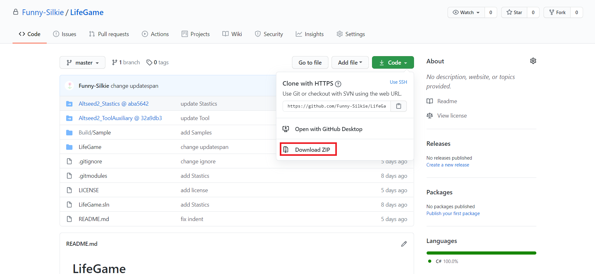

# ビルド方法等

## ダウンロード

### gitが入っている場合

当リポジトリを任意のディレクトリにダウンロードする方法は以下の通りです。
ダウンロードしてからフォルダを移動だとかなり時間がかかるのでお気をつけて。
各行のコマンドを順番に実行してください。
環境はWin10想定です。

```
cd <ダウンロード先のディレクトリ>
git clone --recursive https://github.com/Funny-Silkie/LifeGame.git
```

### gitが入っていない場合

このリポジトリの[トップ](https://github.com/Funny-Silkie/LifeGame)へ行き，**↓Code**ボタンを押して出てくる**DownLoad zip**をクリックして任意のディレクトリに解凍してください。(下図参照)



解凍すると以下のフォルダ/ファイルが並ぶと思います

```
Altseed2_Stastics/
Altseed2_ToolAuxiliary/
Build/
LifeGame/
.gitignore
.girmodules
LICENSE
LifeGame.sln
README.md
```

次に，LifeGameのzipを落としたところの，`Altseed2_Stastics @~~`と書かれているところをクリックしてAltseed2_Stasticsリポジトリにとび，そこから同様にzipを落とします。落としたzipの中身を`Altseed2_Stastics`フォルダに解凍します。
続けて`Altseed2_Stastics`を落としたところから`Altseed2-csharp @~~`をクリックしてそこからzipを落とし，`Altseed2-csharp`フォルダ内にその中身をコピーします。その後は`Altseed2-csharp`フォルダ内に`Core @~~`から落とせるzipの中身を出して…をどんどん繰り返していきます。
めんどくさいのでgit入れた方が良いです。

## ビルド

まず`Altseed2.Core`のビルドを行います。
Coreのビルドに関しては[こちら](https://github.com/altseed/Altseed2/blob/master/documents/development/HowToBuild_Ja.md)を参照。
終わったら以下のコマンドを打つことで，`Build`フォルダに一連のファイルが生成されます。

```
cd <LifeGame.slnのあるディレクトリ>
dotnet build LifeGame.sln -c Release
```